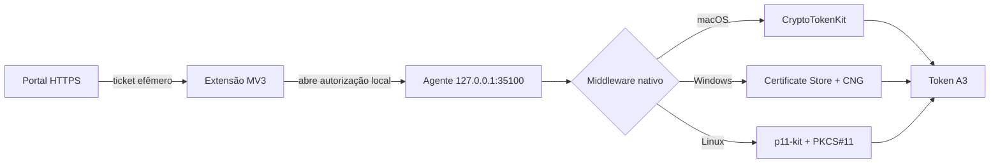

# Maiocchi PAdES Token Extension

Extensão Chrome/Chromium Manifest V3 que conecta exclusivamente o portal
`assinatura.maiocchi.adv.br` ao agente local de assinatura PAdES.

## Download

A versão validada está na página de
[releases](https://github.com/rogermaiocchi/maiocchi-pades-token-extension/releases/latest).
O arquivo operacional é `maiocchi-pades-token-extension-v1.0.1.zip`.

## Arquitetura



O agente nativo e o driver/middleware do fabricante continuam obrigatórios
para tokens físicos. Uma página hospedada na VPS não pode acessar uma chave
privada USB remota sem um componente local. Certificados A3 em nuvem seguem o
fluxo próprio do PSC emissor e não usam esta extensão.

## Limites de segurança

- A extensão não acessa PIN, chave privada, certificado ou conteúdo do PDF.
- A identidade é fixa: `cbikodnffamnfjoaobfpacilcfilmjlh`.
- O content script só executa em `https://assinatura.maiocchi.adv.br/assinar-icp*`.
- O ticket é base64url de 43 caracteres e entra no agente somente pelo fragmento
  `#ticket=`, nunca em query string, log HTTP ou referrer.
- O service worker valida `sender.url` e a aba antes de abrir a autorização.
- Não há analytics, código remoto, `eval`, IA ou permissão genérica de navegação.
- A sondagem sem `Origin` alcança apenas `GET /v1/status`; certificado e
  assinatura permanecem protegidos por origem autorizada e consentimento local.

## Instalação no Chrome

1. Instale o agente nativo adequado ao sistema e o middleware oficial do token.
2. Baixe e descompacte o ZIP da release.
3. Abra `chrome://extensions`, habilite **Modo do desenvolvedor** e selecione
   **Carregar sem compactação**.
4. Escolha a pasta descompactada que contém `manifest.json`.
5. Abra o portal e clique no ícone da extensão para confirmar **Disponível**.

O Chrome não permite instalação silenciosa de extensões auto-hospedadas em
perfis pessoais. Distribuição sem esse passo exige publicação na Chrome Web
Store ou política corporativa administrada.

## Desenvolvimento

Requisitos: Node.js 22.13 ou superior.

```bash
npm ci
npm test
npm run smoke:agent
npm run package
```

`npm test` executa testes de protocolo, gera bundles clássicos compatíveis com
content scripts MV3 e audita manifest, CSP, permissões, ícones, código dinâmico,
URLs remotas e source maps. O ZIP é gerado em `release/`.
`npm run smoke:agent` é uma validação macOS opcional: exige o agente em execução
e um token físico conectado, mas não imprime dados do titular ou certificados.

## Referências maduras

Os padrões incorporados e suas revisões exatas estão em
[`THIRD_PARTY_NOTICES.md`](THIRD_PARTY_NOTICES.md). A base principal é o
`web-eid/web-eid-webextension` (MIT), complementada pelas amostras oficiais do
Chromium e pelo modelo de identidade/CSP do Browserpass.

## Licença

MIT. Consulte [`LICENSE`](LICENSE).
