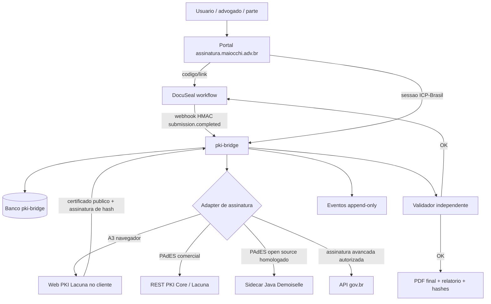

# Arquitetura de assinatura centralizada ICP-Brasil e gov.br

Atualizado em 2026-07-11.

## Direcao

Unificar o portal de assinaturas em torno de um servico central de assinatura, mantendo o DocuSeal como motor de workflow documental e separando claramente tres planos:

1. assinatura eletronica simples do DocuSeal;
2. assinatura qualificada ICP-Brasil com certificado A1/A3;
3. assinatura avancada gov.br, quando houver permissao formal de integracao.

A regra operacional e que confianca nasce de validacao rastreavel. Nenhum componente sera tratado como produtivo apenas por estar integrado no codigo.

## Estado real coletado

- Portal publico: `assinatura.maiocchi.adv.br`, Next static export servido por Nginx.
- DocuSeal: `documentos.assinatura.maiocchi.adv.br`, container saudavel na VPS.
- `pki-bridge`: ja existe como servico Node em desenvolvimento, com cliente REST PKI Core, webhook DocuSeal, maquina de estados e testes.
- Token A3 ICP-Brasil: visivel no MacBook por SmartCardServices/CryptoTokenKit.
- Portal local: rota `/certificado-icp-brasil/` criada com painel Web PKI para listar certificado e testar assinatura de hash.
- VPS: `CERTIFICATE_AUTH_ENABLED=true` foi aplicado no DocuSeal apos backup `20260711T203627Z`.
- Pendencia operacional: o CSP publico ainda precisa publicar a permissao para `https://cdn.lacunasoftware.com`; no momento da coleta publica, o cabecalho remoto ainda bloqueava scripts externos.
- Pendencia funcional: `https://certificado.assinatura.maiocchi.adv.br/certificate_auth/login/present` ainda respondeu `404`, apesar da flag ativa. Isso indica que o Traefik chega ao DocuSeal, mas a rota/app de autenticacao por certificado ainda nao esta efetivamente disponivel.

## Pesquisa de repositorios

| Repositorio | Estado verificado | Decisao |
|---|---:|---|
| `demoiselle/signer` | Java, README declara suporte CAdES, XAdES e PAdES, LGPL v3, push em 2026-07-04 | Usar como candidato principal open source para sidecar Java de montagem/validacao PAdES, apos spike |
| `servicosgovbr/manual-integracao-assinatura-eletronica` | Manual de integracao gov.br, push em 2026-03-24 | Usar como fonte normativa/contratual; nao copiar codigo |
| `c0h1b4/autenticacao-ICP-Brasil` | Exemplo Nginx/Node para mTLS com A1/A3, push em 2020-06-12 | Usar como referencia de infraestrutura mTLS; nao como motor de assinatura |
| `OpenICP-BR/libICP` | Go, CAdES, README AGPL, features incompletas para CMS/AD-* e sem smartcard, push em 2018 | Rejeitar como dependencia produtiva; consultar somente como referencia historica |
| `OpenICP-BR/ktLib` | Kotlin, CAdES, LGPL, Bintray antigo, push em 2018 | Rejeitar para producao; nao atende PAdES do portal |
| `OpenICP-BR/ktApp` | App desktop Kotlin, push em 2018 | Rejeitar; nao e servico de backend |
| `OpenICP-BR/wxApp` | App desktop, README AGPL, features indicam assinatura mas verificacao/CRL/smartcard pendentes, push em 2018 | Rejeitar; risco AGPL e lacunas funcionais |
| `opensignature/pdfsign` | C++/PoDoFo/OpenSSL, PAdES compatible, baixa tracao | Referencia tecnica de baixo nivel; nao incorporar |
| `sign_pdf` citado no plano | Busca `gh` por `sign_pdf DOC-ICP-15` nao encontrou repositorio rastreavel correspondente | Nao usar ate identificar URL, licenca e manutencao |

## Resultado da mesa de debate

Mesa CLI executada com vozes `xai`, `zai`, `deep`, `mistral`, `qwen` e `openrouter` validas. `hf`, `kimi`, `gemini`, `nvidia` e `agy` falharam por transporte/timeout. A ferramenta nao gravou o JSON final por bug no failover, mas gravou os outputs brutos em `/tmp/mesa-20260711T174206-contexto-p-blico-e-verific-vel-p-*.out`.

Convergencia das vozes:

- manter DocuSeal como workflow, nao como motor criptografico;
- manter `pki-bridge` como orquestrador central;
- tratar Lacuna Web PKI como caminho pragmatico para A3 no navegador;
- usar Demoiselle como candidato open source mais forte para sidecar PAdES;
- usar gov.br como adaptador separado, condicionado a permissao formal de integracao;
- rejeitar OpenICP-BR como dependencia produtiva por antiguidade, lacunas e licencas;
- nao incorporar C++/PoDoFo sem auditoria forte de ByteRange/PAdES;
- validar tudo com PDF real, Adobe/ITI/Lacuna, CRL/OCSP e trilha de eventos.

Divergencia principal:

- algumas vozes sugeriram substituir REST PKI Core por Demoiselle no curto prazo; a decisao local deve ser mais conservadora: manter Lacuna como caminho primario ate que Demoiselle passe em spike PAdES real com certificado de teste e validadores independentes.

## Arquitetura alvo

## Fronteiras de seguranca

- Chave privada, PIN, arquivo A1 e senha nunca entram no portal, no `pki-bridge` ou no DocuSeal.
- O navegador pode acionar Web PKI apenas para listar certificado e assinar hash/desafio local.
- O `pki-bridge` deve receber PDF canonico, calcular hash, controlar estado, preparar/fechar assinatura e registrar evidencias.
- O sidecar Demoiselle, se adotado, fica em rede interna, sem porta publica, chamado apenas pelo `pki-bridge`.
- Traefik pode usar mTLS para autenticacao de sessao, mas mTLS nao substitui assinatura PAdES.
- Headers de certificado vindos do proxy devem ser zerados antes do proxy e reinjetados apenas pelo middleware confiavel.
- Logs nao podem conter PIN, chave, arquivo A1, assinatura bruta desnecessaria, PDF integral ou credenciais.

## Plano de implementacao

### Fase 0 - Estabilizar o que ja foi alterado

1. Publicar o `nginx.conf` com CSP permitindo `cdn.lacunasoftware.com` e os endpoints locais exigidos pelo Web PKI.
2. Validar em producao a rota `/certificado-icp-brasil/` sem erro de CSP no console.
3. Investigar o `404` de `/certificate_auth/login/present` no DocuSeal com `CERTIFICATE_AUTH_ENABLED=true`.
4. Criar teste de smoke HTTP para garantir que a pagina ICP sempre contenha script Web PKI e CTA de autenticacao.

### Fase 1 - Contrato unico do pki-bridge

1. Definir API interna:
   - `POST /workflows/from-docuseal`;
   - `POST /sessions/:id/prepare`;
   - `POST /sessions/:id/complete`;
   - `GET /sessions/:id/status`;
   - `GET /artifacts/:id/report`.
2. Persistir workflow, signatarios, sessoes, artefatos, validacoes e eventos append-only.
3. Fazer todo webhook DocuSeal ser idempotente por hash do evento e da submissao.

### Fase 2 - ICP-Brasil A3 via Web PKI + Lacuna

1. Usar Web PKI para listar certificado e assinar hash/desafio no navegador.
2. Usar REST PKI Core para preparar e fechar PAdES enquanto a licenca e o contrato estiverem validos.
3. Validar PDF final no Adobe Reader, no validador Lacuna e no Validador do ITI.
4. Registrar cadeia, revogacao, politica, carimbo de tempo, hash antes/depois e ByteRange.

### Fase 3 - Sidecar Demoiselle

1. Criar spike isolado `services/pades-demoiselle` com Java e Maven.
2. Assinar PDF de teste com Demoiselle sem modificar a biblioteca.
3. Validar o PDF em ferramentas independentes.
4. Se aprovado, expor API interna para `pki-bridge`; se falhar, manter apenas como referencia.

### Fase 4 - gov.br

1. Confirmar elegibilidade juridica e credenciamento para consumir a API oficial.
2. Implementar adapter separado no `pki-bridge`, sem confundir gov.br avancada com ICP-Brasil qualificada.
3. Mapear identidade gov.br e identidade de certificado como evidencias distintas.
4. Validar artefato retornado pelo gov.br antes de anexar ao fluxo DocuSeal.

### Fase 5 - Unificacao do dominio

1. `assinatura.maiocchi.adv.br` permanece como unica entrada percebida.
2. Rotas de documentos seguem proxy/redirect interno ao DocuSeal.
3. `documentos.assinatura.maiocchi.adv.br` vira compatibilidade tecnica.
4. `certificado.assinatura.maiocchi.adv.br` fica restrito a mTLS/autenticacao quando realmente funcional.

## Criterios de aceite

- `npm test`, `npm run lint` e build Docker passam.
- Portal, DocuSeal e `pki-bridge` saudaveis na VPS.
- CSP produtivo carrega Web PKI sem bloqueio.
- Token A3 assina hash de teste no navegador.
- PDF PAdES real e validado por ferramenta independente.
- Certificado revogado/expirado falha fechado.
- Repeticao de webhook nao duplica assinatura.
- Nenhum codigo AGPL novo entra no runtime produtivo.
- Fonte correspondente do DocuSeal e avisos de licenca permanecem publicados.
- Politica de privacidade e termos descrevem corretamente DocuSeal, Lacuna, gov.br e ICP-Brasil.

## Decisao arquitetural

O desenho recomendado nao e fundir repositorios dentro de um monolito. A fusao correta e por contratos:

- DocuSeal = workflow e UX documental.
- Portal Next = entrada unica e orientacao.
- pki-bridge = estado, idempotencia, seguranca e orquestracao.
- Lacuna Web PKI/REST PKI = caminho primario pragmatica para ICP-Brasil ate homologacao open source.
- Demoiselle = candidato open source para sidecar PAdES.
- gov.br = adapter separado, condicionado a autorizacao.
- OpenICP-BR, wxApp/ktApp e pdfsign = referencias ou rejeicoes, nao dependencias produtivas.
