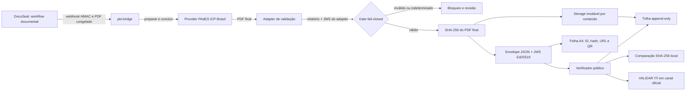
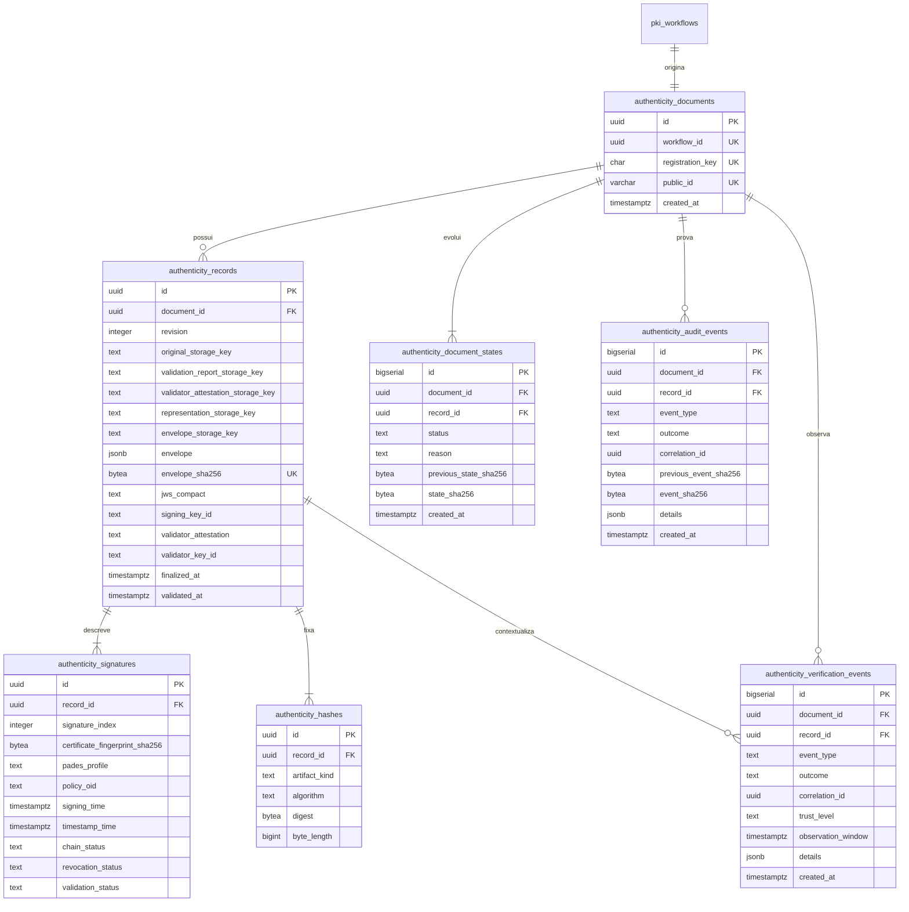

# 1. Padrão ouro de autenticidade

## 1.1 Objetivo

O documento juridicamente relevante é o PDF eletrônico PAdES-ICP-Brasil. A folha de autenticidade é uma representação separada para impressão, com ID, SHA-256 completo, URL e QR Code. Ela reconduz ao registro e ao PDF original, mas não cria nem substitui uma assinatura digital.

O contrato deste documento foi fixado em 12 de julho de 2026. A confiança decorre de bytes, hashes, assinaturas, relatórios e fontes rastreáveis. Texto de interface ou saída de modelo não constitui evidência criptográfica.

## 1.2 Estado comprovado

| Componente | Estado | Evidência |
|---|---|---|
| Contrato da chave | implementado | `public/schemas/authenticity-key-v1.schema.json` |
| Envelope Ed25519/JWS | implementado | `services/pki-bridge/src/authenticity-contract.mjs` |
| Atestado do validador | implementado | `services/pki-bridge/src/validation-attestation.mjs` |
| Hash do PDF final | implementado | `services/pki-bridge/src/authenticity-service.mjs` |
| Storage por conteúdo | implementado | `services/pki-bridge/src/artifact-store.mjs` |
| Folha A4 com QR | implementado | `services/pki-bridge/src/print-representation.mjs` |
| Banco e eventos encadeados | implementado | `services/pki-bridge/db/002_authenticity_gold_standard.sql` |
| Verificador público | implementado | `app/validar/authenticity-verifier.tsx` |
| Testes unitários e HTTP | implementado | `services/pki-bridge/test/` |
| Geração PAdES ICP-Brasil real | implementado | provider DSS privado, agente macOS A3, ticket de uso único e teste real; validação externa segue como conferência independente |
| Integração genérica por API com VALIDAR ITI | não alegada | o guia público não documenta uma API genérica de upload para este caso |

## 1.3 Invariantes

1. O SHA-256 é calculado sobre os bytes finais do PDF já assinado e validado.
2. O PDF final nunca recebe depois disso hash, QR, rodapé, metadado ou nova renderização.
3. A folha impressa é outro PDF e possui hash próprio.
4. O registro só é criado quando todas as assinaturas informadas pelo adapter estão válidas, com cadeia válida, revogação boa, cobertura integral e DocMDP válido.
5. O adapter assina com Ed25519 um atestado ligado a workflow, revisão, SHA-256 do PDF, SHA-256 do relatório e resumo integral; chave desconhecida bloqueia o registro.
6. O perfil aceito é `AD-RB` ou `AD-RT`; `AD-RT` exige carimbo de tempo válido em cada assinatura.
7. O OID precisa constar em allowlist operacional fixada a partir da política comprovada; lista vazia bloqueia registros.
8. PDF, relatório, atestado, folha e envelope são armazenados por conteúdo, em modo somente leitura.
9. O envelope é assinado com Ed25519 e qualquer alteração posterior falha na verificação.
10. O original é restrito por padrão. A existência do QR não autoriza sua divulgação; publicação exige feature flag deliberada.
11. O navegador calcula o hash localmente; o arquivo escolhido para comparação não é enviado ao portal.
12. O VALIDAR ITI é uma conferência independente iniciada pelo usuário, sem falso resultado automatizado.
13. O mesmo workflow e o mesmo pacote produzem a mesma chave de registro e o mesmo ID; replay idêntico retorna o registro existente e divergência retorna conflito.
14. QR Code e Code 128 identificam o registro; o QR aponta à verificação HTTPS e o código de barras codifica `MAI|<id>|R<versão>`. Nenhum deles substitui o hash ou a assinatura PAdES.
15. Destinatário, finalidade, local declarado, tipo de token e papel dos signatários entram no envelope JWS e na folha A4. Campo sem fonte confiável é armazenado como `Não informado`, nunca inferido.
16. A localização é declaração operacional, não prova de geolocalização. O tipo de token também é metadado declarado, não prova criptográfica da mídia.

# 2. Arquitetura



## 2.1 Fronteiras

- DocuSeal gere modelos, participantes e o fluxo documental.
- O provider executa operações PAdES. Chave privada, A1, PIN e senha não ingressam no portal.
- O adapter converte a inspeção do provider para o contrato interno e atesta o pacote com uma chave Ed25519 isolada; ele não pode promover resultado inválido ou indeterminado.
- O `pki-bridge` calcula hashes, cria o envelope, gera a folha, persiste evidências e serve o verificador.
- O portal apresenta fatos do envelope. Ele não revalida cadeia ICP-Brasil no JavaScript.
- O VALIDAR ITI permanece um sistema externo com termos e resultado próprios.

# 3. Esquema de banco de dados



Documentos, registros, estados, assinaturas, hashes, auditorias e observações rejeitam `UPDATE` e `DELETE` por trigger. Status evolui somente pela inserção de novo estado encadeado; identidade e ID público nunca mudam. A auditoria crítica possui cadeia SHA-256 sob lock transacional. `match`/`mismatch` declarados pelo navegador ficam em tabela separada, com `trust_level=untrusted_client_observation`, não integram a prova e são deduplicados por documento, resultado e janela de dez minutos. `authenticity_hashes` fixa cinco artifacts: original PAdES, relatório, atestado do validador, folha e envelope.

# 4. Formato exato da chave

## 4.1 Fonte normativa

O formato normativo é o JSON Schema Draft 2020-12 publicado em:

`https://assinatura.maiocchi.adv.br/schemas/authenticity-key-v1.schema.json`

O envelope canônico tem exatamente duas propriedades de topo: `record` e `proof`. Propriedades adicionais são proibidas.

## 4.2 Exemplo estrutural

Os valores abaixo são ilustrativos e não constituem evidência válida. O OID fictício não deve ser usado em produção.

```json
{
  "record": {
    "schema": "https://assinatura.maiocchi.adv.br/schemas/authenticity-key-v1.schema.json",
    "version": "1.0.0",
    "document": {
      "id": "MAI-2026-1111-1111-1111-1111",
      "revision": 1,
      "mediaType": "application/pdf",
      "size": 2048,
      "hash": {
        "algorithm": "SHA-256",
        "value": "aaaaaaaaaaaaaaaaaaaaaaaaaaaaaaaaaaaaaaaaaaaaaaaaaaaaaaaaaaaaaaaa"
      },
      "finalizedAt": "2026-07-12T12:00:00.000Z"
    },
    "signature": {
      "format": "PAdES",
      "infrastructure": "ICP-Brasil",
      "profile": "AD-RT",
      "policyOid": "0.0",
      "count": 1,
      "docMdp": "valid"
    },
    "validation": {
      "status": "valid",
      "validatedAt": "2026-07-12T12:01:00.000Z",
      "validator": "Adapter de validação PAdES",
      "attestation": {
        "type": "JWS",
        "algorithm": "EdDSA",
        "keyId": "validator-2026-01",
        "hash": {
          "algorithm": "SHA-256",
          "value": "dddddddddddddddddddddddddddddddddddddddddddddddddddddddddddddddd"
        }
      },
      "report": {
        "mediaType": "application/json",
        "size": 512,
        "hash": {
          "algorithm": "SHA-256",
          "value": "bbbbbbbbbbbbbbbbbbbbbbbbbbbbbbbbbbbbbbbbbbbbbbbbbbbbbbbbbbbbbbbb"
        }
      }
    },
    "representation": {
      "type": "authenticity-sheet",
      "mediaType": "application/pdf",
      "size": 4096,
      "hash": {
        "algorithm": "SHA-256",
        "value": "cccccccccccccccccccccccccccccccccccccccccccccccccccccccccccccccc"
      }
    },
    "disclosure": {
      "mode": "restricted"
    },
    "links": {
      "verify": "https://assinatura.maiocchi.adv.br/v/MAI-2026-1111-1111-1111-1111",
      "original": null,
      "print": "https://assinatura.maiocchi.adv.br/folha/MAI-2026-1111-1111-1111-1111.pdf",
      "officialValidator": "https://validar.iti.gov.br/"
    }
  },
  "proof": {
    "type": "JWS",
    "algorithm": "EdDSA",
    "keyId": "authenticity-2026-01",
    "value": "ZXhhbXBsZQ.ZXhhbXBsZQ.ZXhhbXBsZQ"
  }
}
```

## 4.3 Canonicalização e prova

As chaves de objeto são ordenadas por código Unicode, sem espaços. O JWS compacto carrega esse JSON canônico como payload e usa Ed25519. A chave pública correspondente é publicada em `/chaves/{keyId}.pem`. A assinatura do envelope prova o registro do portal; não substitui a assinatura PAdES contida no PDF.

# 5. Rotas públicas e internas

| Método e rota | Função | Exposição |
|---|---|---|
| `GET /v/{id}` | redireciona QR para `/validar/?codigo={id}` | pública |
| `GET /verificacao/{id}` | devolve status e envelope verificado | pública |
| `POST /verificacao/{id}/evento` | registra somente `match` ou `mismatch` | pública, limitada |
| `GET /folha/{id}.pdf` | entrega a representação impressa | pública |
| `GET /original/{id}.pdf` | entrega apenas quando `disclosure=public` | restrita por padrão |
| `GET /chaves/{keyId}.pem` | chave pública do envelope | pública |
| `POST /internal/authenticity/records` | registra pacote validado com HMAC e janela temporal | rede interna |

Rotas GET não escrevem telemetria. O POST de comparação registra apenas uma observação não confiável, amostrada uma vez por resultado em cada janela de dez minutos. O endpoint interno recebe `timestamp.HMAC-SHA256(timestamp + "." + corpo bruto)` no cabeçalho `X-Maiocchi-Signature`. Além do HMAC e da janela de cinco minutos, o corpo deve conter `validationAttestation`, um JWS de chave autorizada. O mesmo pacote é idempotente; pacote divergente para o mesmo workflow recebe `409`. O Traefik não publica a rota `/internal`.

# 6. Folha impressa

A folha é A4, uma página, com margens fixas, QR com correção de erro M, ID textual, hash completo em quatro linhas, URL, referência ao VALIDAR ITI, data/hora, versão e paginação. O texto canônico é:

> Esta folha não substitui o PDF eletrônico assinado. O valor criptográfico e a validação pertencem ao arquivo PAdES original; confira a correspondência pelo código, pelo hash SHA-256 e pelo endereço abaixo.

Ela não contém o PDF original nem dados dos signatários. Para documento restrito, a página confirma o registro, mas mantém o download do original bloqueado.

# 7. Segurança, privacidade e operação

- CORS aceita apenas o domínio principal e previews explicitamente configurados.
- O endpoint público tem rate limit no Traefik e não coleta o PDF comparado.
- Somente `match`/`mismatch` explícito registra observação pública não confiável, sem IP, user agent ou conteúdo documental, com deduplicação atômica em janela de dez minutos.
- O storage verifica o hash em toda leitura.
- A chave Ed25519 fica em arquivo somente leitura fora da imagem e do Git.
- A chave privada do adapter não compartilha diretório nem processo com o `pki-bridge`; o serviço recebe somente chaves públicas e um `keyring.json` com status e validade. Apenas chave `active` dentro da janela de `issuedAt` autoriza novo registro.
- Backup deve cobrir PostgreSQL, artifacts e chave cifrada em repositório segregado.
- Rotação mantém chaves públicas antigas enquanto houver documentos verificáveis com o respectivo `keyId`.

# 8. Próximo nível

## 8.1 P0 - Fechar o ciclo PAdES real

1. Contratar e configurar provider com perfil PAdES ICP-Brasil comprovado.
2. Conectar a inspeção do provider ao signer isolado do atestado já exigido pelo contrato.
3. Executar A1 e A3 em documento de homologação, com AD-RB e AD-RT quando contratados.
4. Comparar o mesmo PDF no provider, no Adobe e no VALIDAR ITI.
5. Fixar OIDs, política, cadeia, revogação, DocMDP, `ByteRange` e carimbo de tempo observados.
6. Só então habilitar o registro automático após `submission.completed`.

## 8.2 P1 - Evidência de longo prazo

1. Mover artifacts para object storage com versionamento e Object Lock/WORM.
2. Proteger a chave do envelope em KMS/HSM ou serviço de assinatura isolado.
3. Implementar rotação, revogação e publicação histórica das chaves Ed25519.
4. Definir preservação de CRL/OCSP, relatórios e carimbos conforme a política aplicada.
5. Criar restore periódico com recomputação integral de hashes e cadeia de eventos.

## 8.3 P2 - Privacidade e circulação

1. Implementar autorização de curta duração para originais restritos.
2. Permitir notificação de conferência somente por configuração explícita e base legal definida.
3. Aplicar retenção por classe documental e legal hold.
4. Testar direitos do titular, descarte, restauração e reexecução de exclusões em backup.

## 8.4 P3 - Conformidade independente

1. Criar corpus de PDFs válidos, inválidos, revogados, expirados, incrementais e adulterados.
2. Rodar matriz de conformidade em três validadores independentes.
3. Submeter arquitetura, termos e política a revisão jurídica e de segurança independente.
4. Publicar somente claims demonstrados por artefato rastreável.

# 9. Fontes oficiais

- ITI, documentos principais e versão vigente do DOC-ICP-15.03: `https://www.gov.br/iti/pt-br/assuntos/legislacao/documentos-principais/`
- DOC-ICP-15.03 v9.1: `https://www.gov.br/iti/pt-br/assuntos/legislacao/documentos-principais/v9.1_IN2021_03_DOCICP15.03_compilada.pdf`
- Guia do Desenvolvedor do VALIDAR: `https://validar.iti.gov.br/guia-desenvolvedor.html`
- Validador oficial: `https://validar.iti.gov.br/`
- Serviço oficial de validação: `https://www.gov.br/pt-br/servicos/validar-servico-de-validacao-de-assinaturas-eletronicas`
