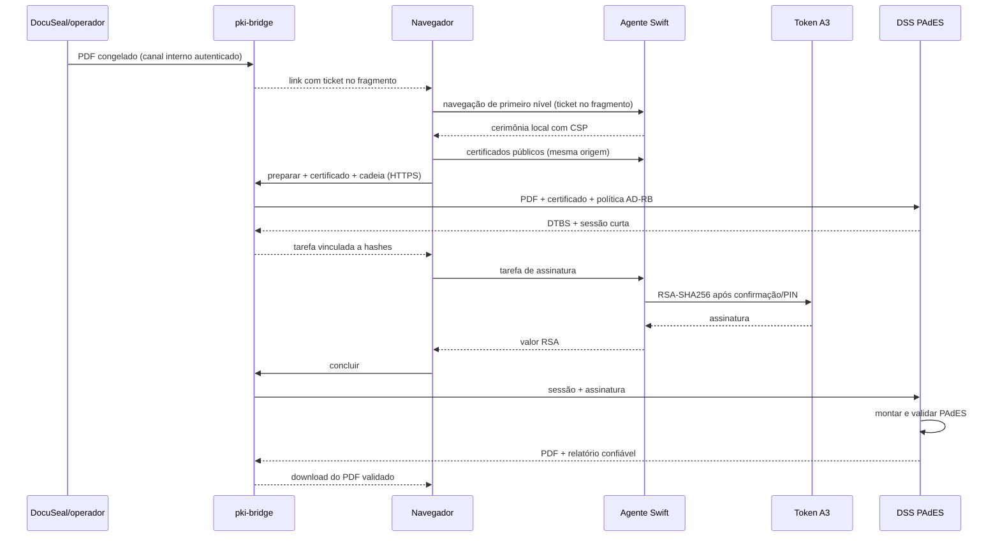

# Provider PAdES privado

## Contratos

O endpoint interno `POST /internal/pades/tickets` recebe PDF e nome sob o mesmo HMAC usado pelas integrações internas. As rotas públicas `/api/pades/ticket`, `/prepare`, `/complete` e `/result` exigem o ticket em `Authorization: Bearer`.

O agente local expõe `/v1/authorize`, `/v1/status`, `/v1/certificates` e `/v1/sign`. O portal navega para `/v1/authorize#ticket=...`; por ser fragmento, o ticket não integra o `GET`, logs ou cabeçalho `Referer`. A página local usa CSP restritiva, acessa o agente em mesma origem e chama o bridge remoto somente por HTTPS. Assim Safari e Chrome não dependem de mixed content ou Private Network Access para a cerimônia.

O corpo assinado contém sessão, DTBS, algoritmo, fingerprint, hash/nome do documento e expiração. A assinatura aceita é RSA PKCS#1 v1.5 com SHA-256, compatível com o certificado A3 validado no MacBook.

### Normalização e vinculação do PDF

Toda apresentação nova é congelada antes do DTBS com os elementos de catálogo
que o DSS 6.4 exige para a aparência PAdES: extensão `ADBE`, versão-base `1.7`,
nível `8`, e um único `OutputIntent` sRGB. O perfil ICC incorporado tem `6.876`
bytes e SHA-256
`87e382b9336e6a0417a4d860173109ab319a029cf2972e19833a3327c65bd7e4`,
idêntico ao produzido pelo Java 21 da imagem de produção.

O bridge exige que o PDF assinado seja uma revisão incremental cujo prefixo é o
PDF preparado e cuja única lacuna criptográfica é `/Contents`. Catálogo,
páginas, referências, anotações e AcroForm são comparados semanticamente. Uma
referência de página encerra a travessia recursiva porque cada página é verificada
separadamente, com identidade e ordem próprias; isso evita que um destino em
`/Names`, `/Outlines` ou anotação reproduza indevidamente a alteração permitida
do widget em outra página.

Tickets legados, preparados antes da normalização, só admitem a mutação exata do
DSS: a extensão `ADBE` acima e o mesmo perfil sRGB, sem chaves adicionais. Perfil,
condição, nível ou conteúdo divergente falham fechado.

## Gates de produção

1. Política AD-RB v1.3 e SHA-256 devem coincidir com o ITI.
2. Apenas raízes ICP-Brasil vigentes podem integrar a trust store.
3. A cadeia do signatário deve terminar em uma dessas raízes e revogação deve ser conclusiva.
4. O PDF final deve conter a política esperada e passar no DSS.
5. O mesmo arquivo deve passar no VALIDAR ITI em ensaio de homologação.
6. O agente distribuído deve possuir assinatura Developer ID e notarização; a instalação local do MacBook pode usar assinatura local controlada.

O gate 5 foi satisfeito em produção em 13 de julho de 2026. A evidência e o
contrato para regressões estão na
[baseline PAdES homologada](../baseline/2026-07-13-pades-iti-approved.md).

## Referência PJeOffice, sem integração

O PJeOffice Pro é referência de experiência para separar navegador, agente local e certificado. Não é dependência, SDK, fornecedor nem canal de assinatura deste portal. A documentação do PJe informa que seu uso por aplicações não relacionadas ao PJe está atualmente limitado a domínios `*.jus.br`, `*.mp.br`, `*.gov.br` e `*.def.br`; `assinatura.maiocchi.adv.br` está fora desse escopo.

O portal adota somente princípios gerais compatíveis com esse modelo:

1. agente local separado do navegador;
2. seleção explícita da identidade e confirmação legível antes do uso do A3;
3. apresentação de metadados verificáveis da assinatura: signatário, data, nome comum do certificado e emissor;
4. retorno do PDF somente após conclusão e validação do serviço PAdES.

Não são adotados nem imitados binários, protocolo, whitelist de domínios, marca ou alegação de compatibilidade/homologação do PJeOffice.

## Compatibilidade Certisign e macOS

A Certisign condiciona a utilização A3 no macOS ao modelo de mídia, driver e gerenciador criptográfico. Portanto, o agente não afirma compatibilidade universal. Cada combinação é liberada apenas após teste reproduzível de detecção da identidade, assinatura RSA-SHA256, montagem PAdES e validação independente. A matriz, seu responsável e a periodicidade estão em [compatibilidade Certisign/macOS](../operations/certisign-macos-compatibility.md).

## Fontes rastreáveis

- [PJeOffice Pro: escopo e limitação de domínios](https://docs.pje.jus.br/servicos-negociais/pjeoffice-pro/)
- [PJe: campos da tabela de assinaturas](https://docs.pje.jus.br/configura%C3%A7%C3%B5es-do-pje/Regras%20de%20interface/)
- [ITI: DOC-ICP-15.01, 15.02 e 15.03 vigentes e alterações de 2025](https://www.gov.br/iti/pt-br/assuntos/legislacao/instrucoes-normativas/instrucoes-normativas)
- [Certisign: drivers A3 para macOS](https://suporte.certisign.com.br/duvidas-suporte/certificado-a3-drivers?cod_rev=102497)
- [DSS 6.4: release oficial](https://github.com/esig/dss/releases/tag/6.4)
- [DSS 6.4: inclusão oficial de OutputIntent sRGB](https://github.com/esig/dss/blob/6.4/dss-pades-pdfbox/src/main/java/eu/europa/esig/dss/pdf/pdfbox/visible/AbstractPdfBoxSignatureDrawer.java)
- [DSS 6.4: teste oficial da extensão ADBE 1.7 nível 8](https://github.com/esig/dss/blob/6.4/dss-pades/src/test/java/eu/europa/esig/dss/pades/signature/extension/PAdESLevelB17PdfDeveloperExtensionTest.java)
