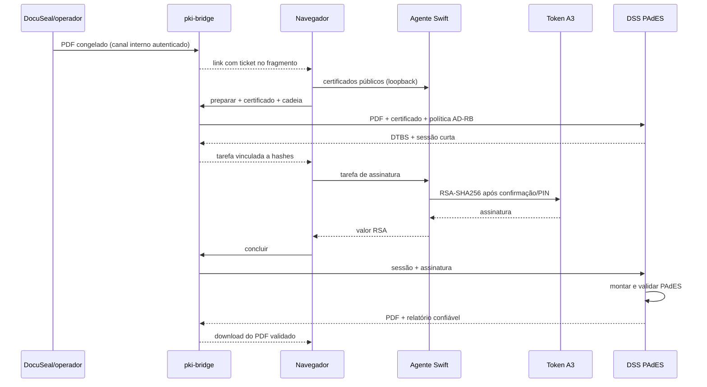

# Provider PAdES privado

## Contratos

O endpoint interno `POST /internal/pades/tickets` recebe PDF e nome sob o mesmo HMAC usado pelas integrações internas. As rotas públicas `/api/pades/ticket`, `/prepare`, `/complete` e `/result` exigem o ticket em `Authorization: Bearer`.

O agente local expõe `/v1/status`, `/v1/certificates` e `/v1/sign`. O corpo assinado contém sessão, DTBS, algoritmo, fingerprint, hash/nome do documento e expiração. A assinatura aceita é RSA PKCS#1 v1.5 com SHA-256, compatível com o certificado A3 validado no MacBook.

## Gates de produção

1. Política AD-RB v1.3 e SHA-256 devem coincidir com o ITI.
2. Apenas raízes ICP-Brasil vigentes podem integrar a trust store.
3. A cadeia do signatário deve terminar em uma dessas raízes e revogação deve ser conclusiva.
4. O PDF final deve conter a política esperada e passar no DSS.
5. O mesmo arquivo deve passar no VALIDAR ITI em ensaio de homologação.
6. O agente distribuído deve possuir assinatura Developer ID e notarização; a instalação local do MacBook pode usar assinatura local controlada.
