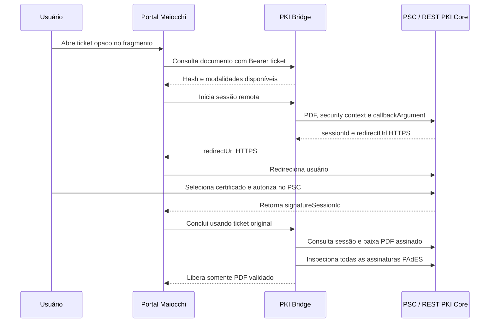

# Assinatura remota sem instalação

## Decisão

O portal usa uma sessão de assinatura de um Prestador de Serviço de Confiança (PSC) para permitir PAdES ICP-Brasil sem instalar software no computador. A VPS nunca recebe PIN, chave privada ou conteúdo criptográfico do certificado do usuário. O A3 físico continua como modalidade distinta porque a chave do token USB não pode ser operada por um servidor remoto nem pelo JavaScript comum do navegador.

O adapter implementado usa a API de sessões do REST PKI Core. O Cloudhub ou conector equivalente reúne os certificados de nuvem dos PSCs habilitados na assinatura. Para produção privada, essa é a fronteira correta de custódia. A API de assinatura GOV.BR não é usada como atalho: a integração oficial é destinada a órgãos e serviços públicos e exige credenciamento próprio.

## Fluxo



## Gates fail-closed

1. O retorno e o redirect usam HTTPS.
2. O `sessionId` precisa ser UUID válido e coincidir com o valor persistido para o ticket.
3. O `callbackArgument` devolvido pelo PSC precisa coincidir com o UUID interno do ticket.
4. A sessão precisa estar `Completed` e conter exatamente um PDF.
5. O PDF precisa iniciar com `%PDF-`, ser inspecionado pelo provider e ter ao menos um signatário.
6. Toda assinatura precisa retornar `validationResults.passed = true`.
7. O PDF validado é cifrado em repouso, identificado pelo SHA-256 do conteúdo final e só então liberado.
8. Ausência ou configuração parcial do PSC deixa a modalidade remota indisponível; não há simulação nem fallback silencioso.

## Configuração de produção

As três variáveis abaixo formam um conjunto indivisível:

```text
REST_PKI_CORE_ENDPOINT=https://...
REST_PKI_CORE_API_KEY=<segredo fora do Git>
REST_PKI_CORE_SECURITY_CONTEXT_ID=<uuid homologado>
```

O security context deve exigir cadeia ICP-Brasil e política PAdES aprovada. A credencial fica somente no `.env` da VPS e não é variável pública de build. Antes da ativação deve haver contrato/licença, tenant, PSCs de nuvem habilitados, ambiente de homologação e teste real com certificado elegível.

## Estado de entrega

- Adapter, persistência, rotas, interface e testes automatizados: implementados.
- Provider local PAdES e A3 físico: implementados como contingência.
- Ativação da modalidade remota: depende das três credenciais comerciais reais; até lá o botão não é exibido.
- A3 USB sem componente local: tecnicamente impossível no modelo de segurança do navegador. O equivalente sem instalação é um certificado remoto já custodiado por PSC.

## Fontes rastreáveis

- [REST PKI Core: signature sessions](https://docs.lacunasoftware.com/en-us/articles/rest-pki/core/integration/signature-sessions/index.html)
- [Lacuna Cloudhub](https://cloudhub.lacunasoftware.com/)
- [REST PKI Core on-premises e licenças](https://docs.lacunasoftware.com/pt-br/articles/rest-pki/core/on-premises/docker.html)
- [Manual da API de Assinatura Eletrônica GOV.BR](https://manual-integracao-assinatura-eletronica.servicos.gov.br/pt-br/latest/iniciarintegracao.html)
- [Requisitos de integração GOV.BR para órgãos públicos](https://www.gov.br/governodigital/pt-br/identidade/assinatura-eletronica/assinatura-eletronica-para-orgaos)
