# Baseline homologado PAdES ICP-Brasil - 2026-07-13

- Status: canônico
- Ambiente: produção, `assinatura.maiocchi.adv.br`
- Provider: `maiocchi/pades-provider:1.1.3`
- Código homologado: `ccda3c5d6e929967460d616ce471c13254519303`
- Validador externo: VALIDAR ITI

Este documento congela o primeiro fluxo A3 do portal aprovado de ponta a ponta pelo
VALIDAR ITI. Ele é a referência técnica obrigatória para mudanças posteriores,
especialmente na composição visual do PDF.

## Resultado oficial

O relatório emitido pelo VALIDAR ITI em 13/07/2026 às 10:56:28 BRT registrou:

| Controle | Resultado |
|---|---|
| Status da assinatura | Aprovado |
| Caminho de certificação | Valid |
| Estrutura | Em conformidade com o padrão |
| Cifra assimétrica | Aprovada |
| Resumo criptográfico | `true` |
| Política | `PA_PAdES_AD_RB_v1_3.der` |
| Atributos obrigatórios | Aprovados |
| Mensagem de erro | Nenhuma mensagem de alerta |

Os atributos `IdMessageDigest`, `IdContentType`,
`IdAaEtsSigPolicyId`, `IdAaSigningCertificateV2` e
`SignatureDictionary` foram individualmente classificados como `Valid`.
O relatório identifica a fonte de verificação como `Offline`, exatamente como
emitido pelo serviço, e informa uma assinatura ancorada.

## Artefatos rastreáveis

| Artefato | Identificador ou SHA-256 |
|---|---|
| Documento público | `MAI-2026-W615-JXTW-EEHH-7XGA` |
| Número do documento | `20260713134431150393065818645` |
| PDF original, 12 páginas | `0b5fd83d7eaeb0b983bb4a32b0e16a4dd4c139a0053036643283c0cb19e01282` |
| Representação probatória incorporada | `22d8c47400a1e5a24e4deb507745269f0bdc9dc7663b25f91d6c57a085044e68` |
| PDF PAdES final, 13 páginas | `d6b848586c6fc7fd5358e920fd4c45eaf22301bc7d72ce47c43c9edeb57633a0` |
| Relatório interno do provider | `f05cf26fb593a7405a64b4b87d24feb9636511f20e69a97fcec8aa54f770f080` |
| Relatório PDF baixado do VALIDAR ITI | `73bea551f8532980068e66954628c47df8002b27be536e847f22196fa69aedd6` |
| Imagem implantada na VPS | `sha256:4698ee05b425f0a39d6954a74b34551e8a2c3b8bc113e2ff6ebb806aa1eebc3c` |

O relatório oficial permanece como evidência local e não integra o repositório
público porque contém dados pessoais e informações do certificado. A cópia
privada está na trilha governada
`~/.claude/audit/runs/2026-07-13-pades-iti-approved/`.

## Invariantes criptográficos

| Campo | Valor canônico |
|---|---|
| Perfil | PAdES AD-RB v1.3 |
| OID | `2.16.76.1.7.1.11.1.3` |
| URI | `http://politicas.icpbrasil.gov.br/PA_PAdES_AD_RB_v1_3.der` |
| SHA-256 do arquivo DER | `23da544aef71f7a75dc85fa6e17a83875741e4baef41ec178258a5c86ace54dd` |
| `SignPolicyHash` interno | `23e4be4b9b362172e4ebb0e72b86a133ece5aad843d8651c6e38a0ba3f08fc60` |
| Algoritmo do signatário homologado | RSA com SHA-256 |
| Tipo CMS | `ETSI.CAdES.detached` |
| Certificado | ICP-Brasil A3 |

O checksum do arquivo DER e o `SignPolicyHash` são valores distintos e jamais
podem ser intercambiados. O provider deve recusar o startup ou a entrega quando
arquivo, estrutura ASN.1, OID, URI, algoritmo ou digest divergirem.

## Golden path

```mermaid
flowchart LR
    A["PDF original congelado"] --> B["Carimbos e página probatória"]
    B --> C["Ticket de uso único"]
    C --> D["DSS prepara DTBS e ByteRange"]
    D --> E["Token A3 assina após confirmação e PIN"]
    E --> F["DSS conclui e valida PAdES"]
    F --> G["Hash final e atestado externo ML-DSA-65"]
    G --> H["Verificador Maiocchi: proofVerified true"]
    H --> I["VALIDAR ITI: Aprovado"]
```

Controles independentes executados sobre o mesmo PDF final:

1. `pdfsig`: assinatura válida e documento integralmente assinado;
2. OpenSSL CMS destacado: `Verification successful`;
3. inspeção ASN.1 do CMS: OID, URI e `SignPolicyHash` canônicos;
4. verificador Maiocchi: documento ativo e `proofVerified: true`;
5. VALIDAR ITI: status `Aprovado` e todos os atributos obrigatórios `Valid`.

O atestado ML-DSA-65 é prova adicional do portal. Ele não substitui, modifica
nem se apresenta como assinatura ICP-Brasil.

## Contrato para mudanças visuais

É permitido alterar, antes da preparação da assinatura:

- layout da página probatória final;
- carimbo discreto das páginas;
- logos, QR, Code 128, tipografia, espaçamento e hierarquia;
- aparência visual do campo de assinatura;
- experiência do portal e da cerimônia local.

É proibido:

- editar, otimizar, linearizar ou anexar conteúdo ao PDF depois da conclusão PAdES;
- recalcular manualmente o `ByteRange` ou reescrever o CMS;
- alterar OID, URI, digest da política ou algoritmos para atender ao layout;
- apresentar o hash da entrada como se fosse o hash do PDF final;
- afirmar aprovação do ITI para um novo layout sem novo ensaio.

Cada revisão visual do PDF cria um novo binário e exige nova assinatura. Para
promover o layout a produção, deve passar novamente por renderização visual,
testes automatizados, `pdfsig`, OpenSSL CMS, verificador Maiocchi e VALIDAR ITI.

## Critério de regressão

Uma mudança preserva este padrão somente quando:

1. todas as páginas e a página final renderizam sem corte, sobreposição ou fonte quebrada;
2. QR, código textual e Code 128 reconduzem ao mesmo identificador;
3. o PDF final permanece integralmente coberto pelo `ByteRange`;
4. o CMS contém os invariantes desta baseline;
5. o verificador público confirma o hash binário final;
6. um relatório novo do VALIDAR ITI retorna `Aprovado`.

## Fontes

- [VALIDAR ITI](https://validar.iti.gov.br/)
- [Repositório ITI da política AD-RB](https://www.gov.br/iti/pt-br/assuntos/repositorio/assinatura-digital-com-referencia-basica-ad-rb)
- [DOC-ICP-15.03 v9.1](https://www.gov.br/iti/pt-br/assuntos/legislacao/documentos-principais/v9.1_IN2021_03_DOCICP15.03_compilada.pdf/@@download/file)
